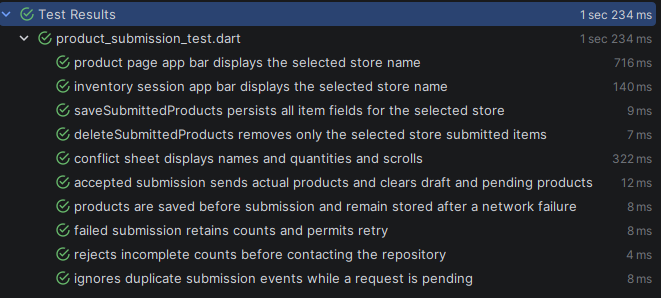

# Inventory Counting



A Flutter mobile demo for selecting a store, counting products, saving drafts locally, and submitting an inventory session. The app includes progress tracking, product search and filters, pending submission details, and a conflict comparison sheet.

**Current scope:** stores and products are fixtures. Submission fetches a mock response; it does not upload inventory to a real backend. The sections below distinguish existing behavior from planned production work.

## Setup and run instructions

1. Install the Flutter SDK matching the versions below and add it to your PATH.
2. Install Android Studio with the Android SDK and an emulator, or connect an Android device with USB debugging enabled. For iOS, use macOS with Xcode and the required CocoaPods setup.
3. Open a terminal in the project root and run:

   ```sh
   flutter doctor
   flutter pub get
   flutter devices
   flutter run -d <device-id>
   ```

4. Select a store, open product counting, and enter a non-negative integer for every product. Zero is a valid count. Counts are saved locally as they change. Submit after all products have been loaded and counted.

An internet connection is required for the current mock submission request. Store selection and product loading use in-code fixtures.

### Windows Android builds

Keep the Pub cache on the same drive as the project. Kotlin incremental compilation can fail when calculating relative source paths across Windows drive letters. For a checkout on `I:`, configure PowerShell once:

```powershell
[Environment]::SetEnvironmentVariable('PUB_CACHE', 'I:\Pub\Cache', 'User')
$env:PUB_CACHE = 'I:\Pub\Cache'
flutter clean
flutter pub get
flutter build apk --debug
```

Restart your IDE and existing terminals after setting the user environment variable. If the checkout moves to another drive, update `PUB_CACHE` to match. Kotlin incremental compilation remains enabled in `android/gradle.properties`.

### Checks and generated files

```sh
flutter analyze
flutter test test/features
```

The feature tests cover count handling, local submission storage, submission success/failure, and conflict presentation. The default `test/widget_test.dart` still contains the starter counter test and needs updating for this app; a full `flutter test` run includes it. These commands are provided for validation, not as a claim that the current checkout passes every check.

Generated assets and Freezed files are checked in. If their inputs change, regenerate them with:

```sh
dart run build_runner build --delete-conflicting-outputs
```

### Backend configuration status

`lib/core/services/urls.dart` declares `INVENTORY_SESSION_ENDPOINT` through `String.fromEnvironment`, and the service locator passes it into the submission data source. However, `InventorySessionRemoteDataSourceImpl` currently ignores that endpoint and the request payload, and performs a GET against a hardcoded Mocki URL. Supplying `--dart-define=INVENTORY_SESSION_ENDPOINT=...` alone does not enable real submission. Implement the backend request and response/error mapping in that data source first.

## Flutter and Dart versions

| Item | Version |
| --- | --- |
| Locally inspected Flutter SDK | 3.47.0, stable |
| Flutter framework revision | `4cf2416426` |
| Bundled Dart SDK | 3.13.0 |
| Dart constraint in `pubspec.yaml` | `^3.13.0` (`>=3.13.0 <4.0.0`) |
| Flutter minimum recorded in `pubspec.lock` | `>=3.44.0` |

The installed framework revision matches the project's `.metadata`. No FVM version pin is present; use Flutter 3.47.0 to reproduce the inspected environment and confirm your installation with `flutter --version`.

## Architecture overview

The code uses a feature-oriented structure with presentation, domain, and data layers:

```text
lib/
  main.dart                  App entry point and root BLoC providers
  config/                    Themes, typography, colors, localization
  core/                      Routing, services, storage, shared widgets/utilities
  features/
    store_selection/         Store selection flow
    inventory_session/       Progress and pending submission overview
    product_page/            Counting, persistence, submission, conflict UI
    test_feature/            Starter/example feature
  gen/                       Generated asset and font references
```

The main request flow is **Page -> BLoC -> Use case -> Repository -> Data source**. Repository operations return `Either<Failure, T>` for explicit success/error handling. GetIt registers dependencies, while `flutter_bloc` provides BLoCs to widgets. GoRouter manages navigation.

Layer separation is partial: product persistence is accessed directly from the BLoC through `ProductUtils`, and the inventory overview directly resolves the product data source. Several shared services and the example feature are inherited scaffold code.

## State-management rationale

BLoC makes count changes, pagination, restoration, and submission explicit events with observable loading, success, and error states. It keeps asynchronous work outside widget rendering and allows use cases/repositories to be substituted in tests. Separate BLoCs organize store selection, inventory progress, and product counting.

Submission and loading guards prevent overlapping duplicate actions, and local writes are serialized through a future queue. Some presentation state still lives in the product page, so state ownership is not fully centralized. BLoC provides a useful structure here, but does not by itself guarantee durable storage or synchronization.

## Local-storage approach

`SecureStorageManager` wraps `flutter_secure_storage`; structured values are JSON encoded. Despite the historical `SharedPrefrences` method names in `ProductUtils`, the count flow does not use SharedPreferences.

## Synchronization strategy

Current synchronization is user-triggered:

1. Load the product pages and restore the selected store's draft.
2. Require every product to have a valid count and wait for queued local saves.
3. Save the pending item snapshot locally.
4. Build a request with a client session ID, store ID, UTC creation time, and items containing product ID, name, count, and expected version.
5. Call the submission use case and retain local data on failure.
6. Clear the draft and pending snapshot when the data source reports success.

The active data source only retrieves a mock response. There is no actual server write, background synchronization, connectivity-triggered retry, exponential backoff, or persisted outbox worker. A retry creates a new timestamp-based client session ID; stable idempotency across retries is not implemented. The saved snapshot omits the complete request envelope and is not automatically replayed after restart.

## Conflict-resolution strategy

The request model carries each product's `expectedVersion`, providing the basis for optimistic concurrency checking by a future backend. A typed `InventorySessionConflictFailure` can be converted by the BLoC into a conflict state while retaining local counts. The conflict sheet compares original system quantity, current system quantity, and the user's counted quantity.

This currently supports conflict presentation, not a complete resolution workflow. The active mock data source does not map real HTTP conflict responses, and the sheet has no accept-server, keep-local, merge, or version-refresh/resubmit action. A quantity difference in local status/filtering is also not proof of a server version conflict.

The intended production approach is server-side version validation followed by an explicit user decision for conflicting items, then resubmission using refreshed versions. No automatic overwrite or last-write-wins policy is implemented.

## Security considerations

- Local count data uses the platform storage provided by `flutter_secure_storage`. This is the current protection mechanism; device compromise and backup/restore behavior have not been assessed.
- **TLS validation is currently bypassed:** `ApiService` sets `badCertificateCallback` to always return `true`. Remove this bypass before using real inventory data; HTTPS alone does not protect this client while the bypass is enabled.
- Authentication is scaffolded but inactive in the request headers. Production APIs need authenticated requests and server-side authorization for each store and inventory operation.
- Debug HTTP logging includes headers and bodies, and the authentication interceptor contains token logging. Redact sensitive fields and remove token logging before enabling real authentication.
- Client validation is for usability. The backend must independently validate store access, product IDs, quantities, versions, and duplicate submissions. Endpoint build definitions are configuration, not a safe place for secrets.

## Performance considerations

Products are accumulated in a map keyed by ID, loaded in pages, and displayed with `ListView.builder`. Loading guards reject duplicate or out-of-order page requests. These choices limit redundant fetching and avoid building every visible-row candidate at once.

Search matches name, SKU, and barcode locally. An active search or filter loads remaining pages to obtain complete results, which can eventually place the entire catalog in memory. State updates rebuild filtered lists, and count changes serialize the full draft map into secure storage. This is reasonable for the three-product demo but needs measurement and changes for large catalogs.

A larger deployment would benefit from indexed local queries or server search, debounced persistence, smaller widget rebuild scopes, and transactional batch writes. The mock product source also adds an intentional one-second loading delay. No production-scale profiling or performance benchmarks are recorded here.

## Assumptions and known limitations

- This is a mobile demo with Android and iOS project folders. Desktop/web support has not been established; the HTTP service uses `dart:io`.
- The current fixtures contain two stores and three products; the product source does not fetch a store-specific catalog.
- Counts are non-negative integers. Partial inventory submission is blocked until every product is loaded and counted.
- The compatibility store key `cairo` maps to API store ID `1` during submission.
- One selected store is held globally, while draft and pending keys are scoped by store. Concurrent store/session workflows are not supported explicitly.
- Persistence retains counts, but there is no cached production catalog, durable multi-session outbox, or accepted-session history. This is not a complete offline synchronization implementation.
- Local storage failures are surfaced, but there is no transactional recovery. Storage operations during success cleanup can fail after the server/data source has already reported acceptance.
- The mock submission depends on an external Mocki service and can fail or change independently of the app.
- Conflict detection against a real backend, resolution actions, authorization, and reliable retry semantics remain unfinished.
- Starter code, placeholder endpoints, unused dependencies, and the starter widget test remain in the repository.

## What I would improve with more time

1. Replace fixtures and mock submission with an agreed API contract, authenticated requests, proper TLS validation, and typed conflict/error mapping.
2. Add a transactional local database for store catalogs, draft versions, session metadata, and a durable outbox. Keep credentials in secure storage.
3. Persist a stable client session ID and implement server idempotency, bounded retries with backoff, and restart-safe synchronization.
4. Complete conflict resolution with explicit user choices, refreshed server versions, and an audit trail.
5. Move local persistence behind repository interfaces and consolidate duplicated state ownership between widgets and BLoCs.
6. Optimize search, incremental storage, and widget rebuilds using measurements on larger catalogs and lower-end devices.
7. Replace the starter test, expand restart/storage-failure and backend contract coverage, add integration tests and CI, and pin the Flutter toolchain.
8. Remove unused scaffold code and dependencies, and finish accessibility, localization, and platform verification.

## Disclosure of AI tools used

OpenAI Codex was used to inspect the current source files and local SDK version, and to draft and update this README. This documentation change does not modify application behavior. Earlier AI involvement in the implementation cannot be established from this documentation task; the project author should add any other tools used and their scope before submission.
